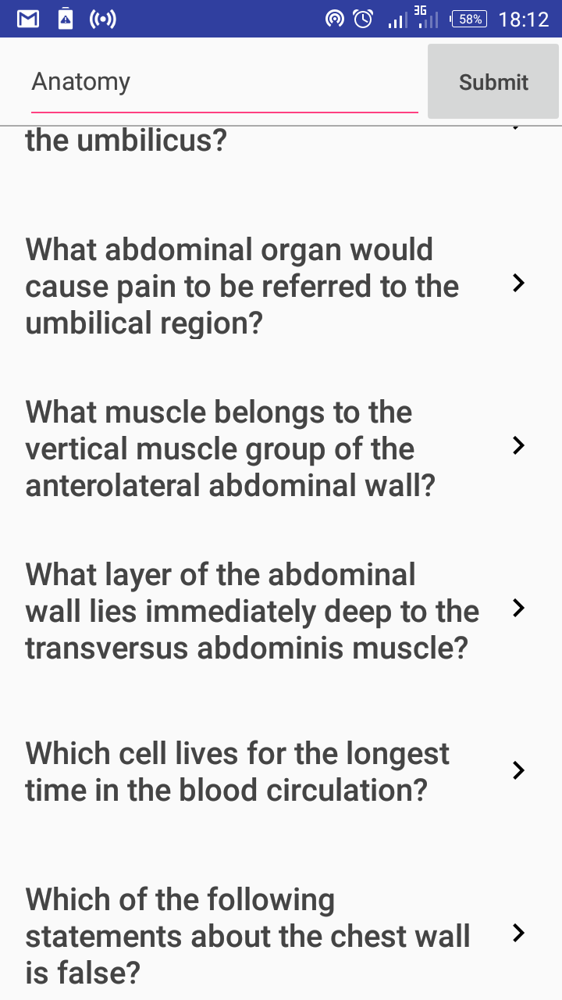
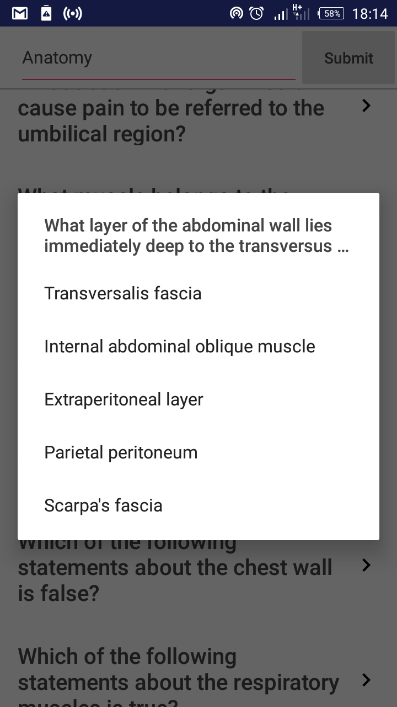

# Lecturio Qetter

## Introduction :point_up:

This repo holds a sample app showing how one can get questions from [Lecturio's](https://www.lecturio.de/) API. 

`Qetter = Question + getter`

## Screenshots

Here is how it looks when fetching questions about anatomy:

 

When one question is selected, this is how the app responds:

 

## License :lock_with_ink_pen:

```
Copyright 2017 Joshua Kairu

Licensed under the Apache License, Version 2.0 (the "License");
you may not use this file except in compliance with the License.
You may obtain a copy of the License at

    http://www.apache.org/licenses/LICENSE-2.0

Unless required by applicable law or agreed to in writing, software
distributed under the License is distributed on an "AS IS" BASIS,
WITHOUT WARRANTIES OR CONDITIONS OF ANY KIND, either express or implied.
See the License for the specific language governing permissions and
limitations under the License.
```